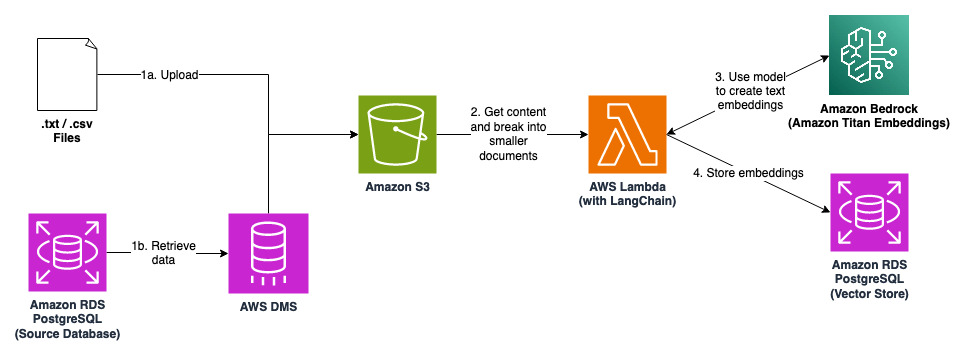
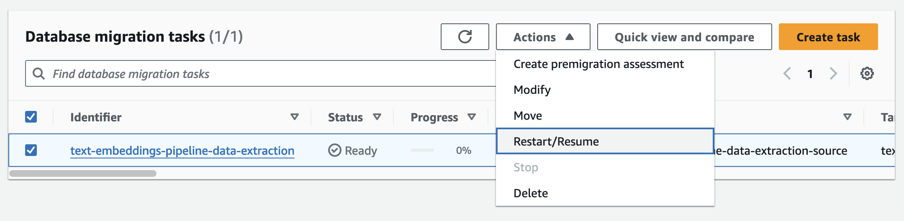

# Text Embeddings Pipeline for Retrieval Augmented Generation (RAG)

This solution is a pipeline to convert contextual knowledge stored in documents and databases into text embeddings, and store them in a vector store. Applications built with Large Language Models (LLMs) can perform a similarity search on the vector store to retrieve the contextual knowledge before generating a response. This technique is known as Retrieval Augmented Generation (RAG), and it is often used to improve the quality and accuracy of the responses.

## ❗ Warning ❗

- **Review and change the configurations before using it for production**: the current configuration should not be used for production without further review and adaptation. Many anti-patterns are adopted to save cost, such as disabling backups and multi-AZ.

- **Be mindful of the costs incurred**: while this solution is developed to be cost-effective, please be mindful of the costs incurred.

## Architecture



## Prerequisites

1. [AWS CDK CLI installed](https://docs.aws.amazon.com/cdk/v2/guide/cli.html)
2. [AWS CLI set up with a default profile](https://docs.aws.amazon.com/cli/latest/userguide/cli-configure-files.html#cli-configure-files-methods)
3. [Python v3.11 installed](https://www.python.org/downloads/)

## Setup

1. Clone this repository.

2. Create an EC2 Key Pair named "EC2DefaultKeyPair" in your AWS account.

3. Install dependencies.

```bash
npm install
```

4. Bootstrap your AWS account with CDK Toolkit (if not done for your AWS account yet).

```bash
cdk bootstrap
```

5. Package Lambda function and its dependencies.

   - macOS: `sh prepare-lambda-package.sh`
   - Windows: `.\prepare-lambda-package.ps1`

6. Deploy the CDK stacks.

```bash
cdk deploy --all --require-approval never
```

7. While waiting for the previous step to complete, go to [Amazon Bedrock](https://us-east-1.console.aws.amazon.com/bedrock/home?region=us-east-1#/modelaccess) in us-east-1 and grant access to "Amazon Titan Embeddings G1 - Text".

## Walkthrough

1. There are two ways to upload data to the S3 bucket.

   - (a) Upload a .txt file with some content (sample.txt is an example) to the S3 bucket created by one of the stacks.

   - (b) Start the DMS replication task in the AWS management console. The data from the source database will be replicated to the S3 bucket and stored in .csv files.

      

   The Lambda function will create text embeddings of the content in .txt / .csv files and store them in the vector store.

2. Connect (SSH or instance connect) to the bastion host. Run the following command (and provide the password) to authenticate. The credentials can be found in the "text-embeddings-pipeline-vector-store" secret in AWS Secrets Manager.

```bash
psql --port=5432 --dbname=postgres --username=postgres --host=<RDS instance DNS name>
```

3. Run the ```\dt``` to list the database tables. Tables with names starting with the prefix "langchain" are created by LangChain automatically as it creates and stores the embeddings.

```
                  List of relations
 Schema |          Name           | Type  |  Owner
--------+-------------------------+-------+----------
 public | langchain_pg_collection | table | postgres
 public | langchain_pg_embedding  | table | postgres
 public | upsertion_record        | table | postgres
(3 rows)
```

4. The documents and embeddings are stored in the "langchain_pg_embedding" table. You can see the truncated values (actual values are too long) by running the following commands.

   - ```SELECT embedding::varchar(80) FROM langchain_pg_embedding;```
      ```
                                          embedding                                     
      ----------------------------------------------------------------------------------
      [-0.005340576,-0.61328125,0.13769531,0.7890625,0.4296875,-0.13671875,-0.01379394 ...
      [0.59375,-0.23339844,0.45703125,-0.14257812,-0.18164062,0.0030517578,-0.00933837 ...
      (2 rows)
      ```
   - ```SELECT document::varchar(80) FROM langchain_pg_embedding;```
      ```
                                          document                                     
      ----------------------------------------------------------------------------------
      What is text embeddings pipeline?,Text embeddings pipeline allows you to create ...
      AWS Health provides improved visibility into planned lifecycle events ...
      (2 rows)
      ```

## Clean Up

1. Destroy all CDK stacks.

```bash
cdk destroy --all
```

## Security

See [CONTRIBUTING](CONTRIBUTING.md#security-issue-notifications) for more information.

## License

This library is licensed under the MIT-0 License. See the LICENSE file.